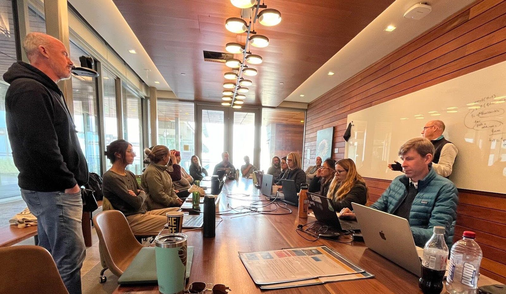

{.float-right .lightbox width=40%}
We design practical, science-based spatial plans that balance conservation, sustainable multiple-use, and climate resilience. Our team brings deep expertise in integrating biodiversity, ecosystem services, and human uses, while avoiding residual protection and supporting genuine stakeholder engagement.

We work with partners to:

*   Define planning needs and objectives

*   Process biodiversity and ecosystem service data

*	Deploy customised, transparent [**_shinyplanr_**](shinyplanr.html) apps for real-time use

*	Facilitate inclusive stakeholder workshops

*	Develop and evaluate candidate spatial plans

Our solutions can incorporate:

*	Multiple-use planning that balances ecological and economic priorities

*	Climate-smart approaches that future-proof conservation under climate change

*	Ecosystem service mapping for carbon, coastal protection, and fisheries

*   Connectivity of different habitats

*   High resolution global species (5-km resolution) and habitat (1-km) distributions

These elements underpin our collaborative approach to delivering effective, equitable, stake-holder focused ocean planning. We are ready to partner with you. Please contact [Anthony](mailto:a.richardson1@uq.edu.au), [Daniel](mailto:Daniel.Dunn@uq.edu.au) or [Jason](mailto:Jason.Everett@uq.edu.au) to discuss future partnerships.

We have developed a concise summary document of our work, which you can [access here](resources/SpatialPlanning.pdf).