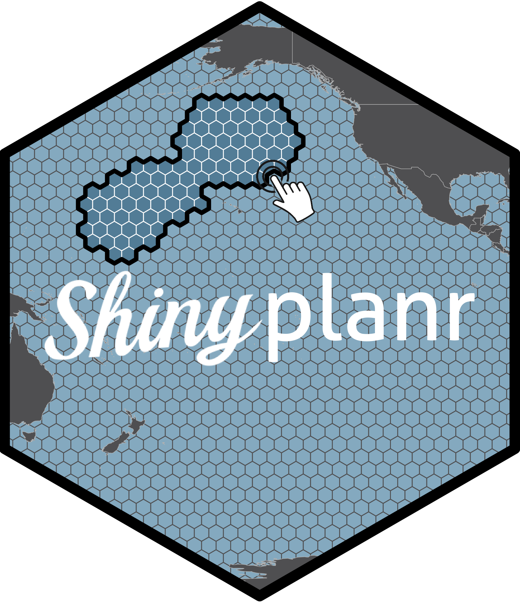

## Real-time planning with _shinyplanr_

The [**_shinyplanr_**](https://spatialplanning.github.io/shinyplanr/){target="blank"} app is a fast, flexible, and transparent web tool that helps countries deliver smarter spatial plans — for biodiversity, climate and people. It puts planning power directly into stakeholders’ hands, letting them test scenarios, explore trade-offs, and make decisions in real time.

Built on robust science and the proven R language and _prioritizr_ engine, [**_shinyplanr_**](https://spatialplanning.github.io/shinyplanr/){target="blank"} helps overcome the delays and disconnects of traditional MSP. It’s user-friendly, fully customisable, and designed for all stakeholders — no prior spatial planning experience is needed.
 
 
 

::: columns
::: {.column width="10%"}
:::
::: {.column width="80%"}

:::
::: {.column width="10%"}
:::
:::
 

## What makes _shinyplanr_ different?

**Real-time planning**: Most scenarios run in seconds, allowing stakeholders to quickly test options and iterate without delays.

**Transparent, user-driven decisions**: Users control targets, costs, and constraints — that means more learning, more trust, and faster buy-in.

**Faster consensus, fewer workshops**: Stakeholders do not need to agree upfront. Instead, they explore plans independently, reducing the need for multiple expert-led workshops.

**Clear trade-offs**: See exactly how different features, zones, and costs shape a plan. Understand where the compromises are — and who is affected.

**Insights that matter**: The **_shinyplanr_** app highlights which features drive solutions. Often, only a few constraints determine the outcome — and this becomes clear through direct exploration.

**Flexible objectives**: Unlike tools with one fixed goal, shinyplanr supports multiple planning questions. Want to see what 30% protection gets you? You can.

**Rich functionality**: Built in R with prioritizr, **_shinyplanr_** offers all the power of Marxan — and then some.

**Scalable and customisable**: From tiny areas such as [Kosrae](whereWeWork/Kosrae.html) in Federated States of Micronesia, to vast regions such as the [Weddell Sea](whereWeWork/WeddellSea.html), **_shinyplanr_** adapts to your geography, language, and data.

::: callout-tip
## Deploying _shinyplanr_ for your region

**_shinyplanr_** is fully transferable — a single codebase that can be customised and deployed to any geography using a combination of global and local datasets. We work closely with partners to co-design planning solutions that support biodiversity conservation, restoration, and sustainable use under a changing climate, continually refining the tool based on user needs and emerging science.

While we typically collaborate directly with governments, agencies, and NGOs to deploy and tailor **_shinyplanr_** for specific regions, the code is fully open-source and available for groups who wish to build and host their own instance. Whether you are looking for a collaborative partnership or want to deploy independently, we welcome you to get in touch.

The **_shinyplanr_** source code is available on [GitHub](https://github.com/SpatialPlanning/shinyplanr){target="blank"}. If you would like to work with us to deploy it for your region, please [contact us](index.qmd).
:::
