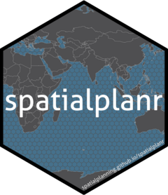
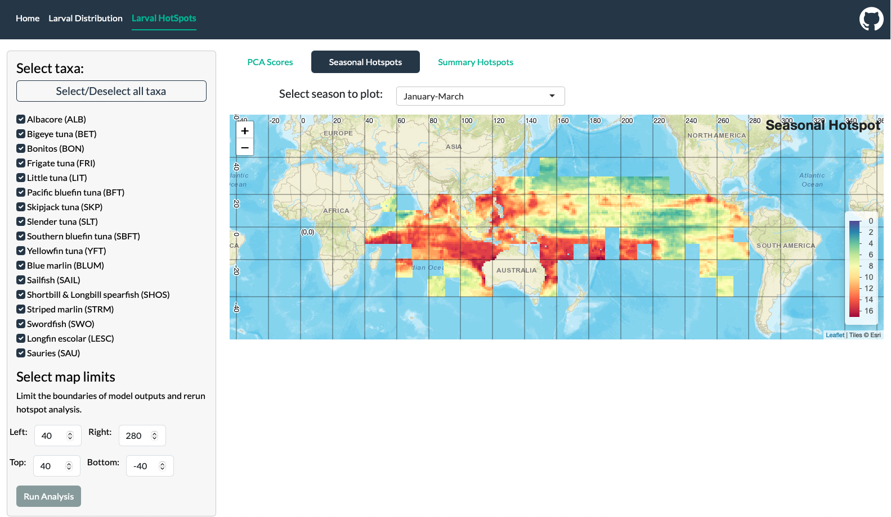
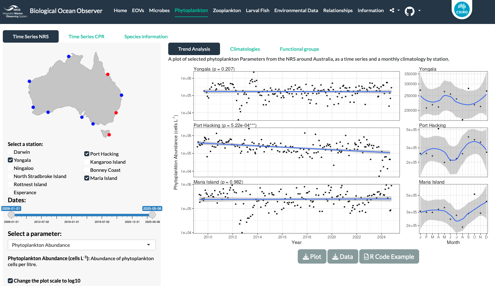

We develop a range of science-based tools for spatial planning and oceanographic analysis.

## R package: _spatialplanr_

{width=20% .lightbox group="shiny" .float-right fig-alt="spatialplanr package"}

The [`spatialplanr`](https://spatialplanning.github.io/spatialplanr) R package is designed to streamline spatial conservation prioritization by providing easy access to key global datasets and simplifying complex planning workflows. Building upon the powerful `prioritizr` package, `spatialplanr` removes common barriers to effective conservation planning by offering convenient functions for accessing and processing essential data sources, including the World Database on Protected Areas (WDPA), IUCN Red List species data, and Global Fishing Watch fishing effort data. The package also provides tools for assigning conservation targets to spatial prioritizations, ensuring that planning efforts are grounded in best-practice conservation principles.

Beyond data access, `spatialplanr` offers functionality for incorporating climate considerations, connectivity analysis, and other advanced planning features into conservation workflows. The package helps planners design robust protected area networks by facilitating the integration of multiple data streams, from biodiversity distributions to human use patterns and environmental variables. While currently in active development, `spatialplanr` represents a significant step toward making comprehensive, data-driven spatial planning accessible to conservation practitioners worldwide.

## R package: _hotrstuff_

{width=20% .lightbox group="shiny" .float-left fig-alt="hotrstuff package"}

The [`hotrstuff`](https://snbuenafe.github.io/hotrstuff/) R package facilitates the rapid download, wrangling, and processing of Earth System Model (ESM) output from the Coupled Model Intercomparison Project Phase 6 (CMIP6). Climate projections from CMIP6 are essential for understanding future ocean conditions and designing climate-smart conservation strategies, yet accessing and processing this data has traditionally required specialized technical expertise and software. `hotrstuff` removes these barriers by leveraging the power of Climate Data Operators (CDO) within the R environment, making advanced climate data processing accessible to conservation practitioners and researchers.

The package streamlines complex climate data workflows with intuitive functions for downloading CMIP6 data, merging files, regridding to custom resolutions, slicing to specific timeframes, and changing temporal frequency (e.g., from monthly to yearly averages). It also enables calculation of vertical means for depth-resolved ESMs and creation of ensemble statistics across multiple models or scenarios. By simplifying access to state-of-the-art climate projections, `hotrstuff` empowers planners to incorporate robust climate information into conservation decisions—supporting the development of protected area networks that remain effective under future environmental conditions. While currently experimental, this tool represents a significant step toward democratizing climate data for conservation applications.

## R package: _minpatch_

The [`minpatch`](https://spatialplanning.github.io/minpatch/) R package implements the MinPatch algorithm for post-processing conservation planning solutions to ensure all protected areas meet user-defined minimum size thresholds. This addresses a critical practical constraint in protected area design: while optimization algorithms like `prioritizr` excel at identifying cost-effective solutions, they may produce fragmented patches that are too small to be ecologically viable or practically manageable.

Based on the methodology described in Smith et al. (2010), `minpatch` systematically adjusts conservation solutions by iteratively evaluating and modifying protected area patches until all meet specified minimum size requirements. This ensures that final protected area networks are not only optimized for biodiversity representation and cost-effectiveness, but also consist of patches large enough to support viable populations, facilitate management, and withstand edge effects. The package integrates seamlessly with `prioritizr` outputs, though it can work with any binary conservation solution raster. By bridging the gap between theoretical optimization and on-ground implementation constraints, `minpatch` helps deliver conservation plans that are both scientifically sound and practically feasible. Note that this package is still under active development.

## Tuna spawning areas

{width=40% .lightbox group="shiny" .float-right fig-alt="Larval Tuna HotSpots"}

The spawning of commercial tuna and billfish species represents a critical ecosystem service essential to global fisheries. Understanding where and when these species spawn is vital for effective management and conservation. We digitised a near-global larval dataset for 15 large pelagic fish species (mainly tuna and billfish) and leveraged machine learning techniques to develop comprehensive distribution models of spawning habitat. These models revealed consistent patterns in spawning timing and location across species, with many co-locating their spawning grounds—likely due to shared environmental benefits such as optimal conditions for larval survival and development.

The modelling showed distinct biogeographic patterns: tropical species spawn widely throughout the year across vast ocean regions, while temperate species exhibit more spatially and temporally restricted spawning behaviours. These insights have important implications for fisheries management and marine spatial planning, particularly for efforts aimed at protecting spawning grounds to ensure sustainable fish stocks. To make these research findings accessible and actionable, we developed an [interactive Shiny App](https://spatialplanning.shinyapps.io/LarvalHotSpots/) that allows fisheries managers, conservation practitioners, and researchers to interrogate the distribution models, explore spawning hotspots, and download data for their own analyses.

## Oceanographic data analysis

{width=40% .lightbox group="shiny" .float-left fig-alt="Biological Ocean Observer"}

The [Biological Ocean Observer](https://shiny.csiro.au/BioOceanObserver/) is an interactive web platform that integrates, analyses, and visualises biological oceanographic data from the Integrated Marine Observing System (IMOS) platforms around Australia. This tool addresses a critical need in ocean observation: making complex, high-volume biological data accessible and interpretable to diverse user communities. The platform enables users to quickly explore temporal and seasonal trends across multiple biological groups, including phytoplankton, zooplankton, larval fish, and microbial communities.

By providing an intuitive interface for data exploration and analysis, the Biological Ocean Observer democratises access to Australia's rich ocean monitoring datasets. Scientists can investigate ecological patterns, industry stakeholders can inform sustainable resource use, policy makers can make evidence-based decisions, and the public can better understand the state of Australia's marine environment. The tool facilitates the translation of raw observational data into meaningful insights about ocean health, ecosystem function, and long-term environmental change—supporting informed stewardship of Australia's ocean estate.

<!-- ## _spatialplanr_ -->

<!-- ## Visualising global zooplankton biomass data -->
<!-- We estimated zooplankton biomass using a statistical model that integrates all available in situ data while adjusting for sampling biases. By accounting for spatial and temporal autocorrelation, and incorporating environmental predictors such as chlorophyll-a and temperature, the model enabled estimates of zooplankton biomass in data-poor regions and times. Unlike spatial smoothing methods, our approach was better suited to the patchy global coverage of zooplankton data. We then developed a shiny app to visualise and download the data (https://jaseeverett.shinyapps.io/ZooMapExtract/). -->
